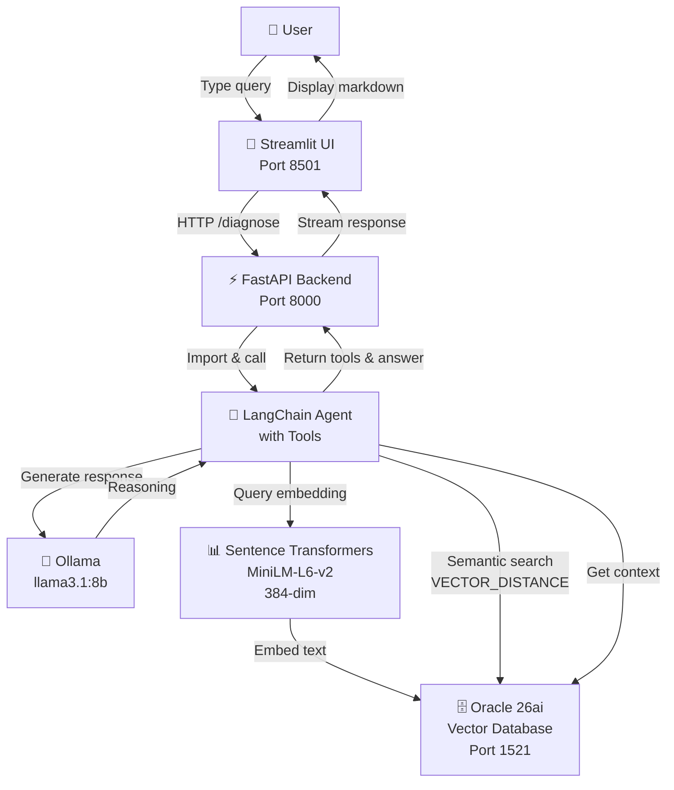

# AI Incident Copilot — Architecture

## High-Level System Diagram



---

## Component Details

### 1. **User Interface** (Streamlit)
- 🎨 **Port**: 8501
- 📝 **File**: `src/copilot/ui/app.py`
- **Responsibility**: Accept user queries, display incident context, show agent reasoning

### 2. **Backend API** (FastAPI)
- ⚡ **Port**: 8000
- 📝 **File**: `src/copilot/api/main.py`
- **Responsibility**: Handle HTTP requests, call LangChain agent, return results
- **Endpoints**:
  - `/diagnose` — main query endpoint
  - `/healthz` — health check

### 3. **Agent** (LangChain)
- 🤖 **File**: `src/copilot/agent/tools.py`
- **Tools**:
  1. `find_similar_incidents()` — semantic search
  2. `find_similar_incidents_filtered()` — semantic + WHERE filters
  3. `get_runbooks_for_incident()` — relational join
  4. `get_service_owner()` — lookup owner
- **Responsibility**: Orchestrate tool calls, reason about incident context

### 4. **LLM** (Ollama)
- 🧠 **Model**: `llama3.1:8b`
- **Local inference** — no API calls, runs on your machine
- **Responsibility**: Generate natural-language responses based on context

### 5. **Vector Database** (Oracle 26ai)
- 🗄️ **Port**: 1521
- **User**: `copilot`
- **Tables**:
  - `services` — catalog of 20 microservices
  - `incidents` — 50 past incidents + embeddings
  - `runbooks` — 15 resolution procedures + embeddings
  - `incident_runbooks` — many-to-many links (107 total)
- **Vector Indexes**: HNSW (COSINE distance)
- **Responsibility**: Store and retrieve incident/runbook context via semantic search

### 6. **Embedding Model** (Sentence Transformers)
- 📊 **Model**: `sentence-transformers/all-MiniLM-L6-v2`
- **Dimensions**: 384-dimensional FLOAT32
- **Responsibility**: Convert text → dense vectors for semantic search

---

## Data Flow Example

```
User: "Payment service is timing out in us-east"
        ↓
[Streamlit] Sends query to FastAPI
        ↓
[FastAPI] Calls LangChain agent
        ↓
[LangChain Agent] Thinks: "This is a latency issue, I should search incidents"
        ↓
[Tool 1: find_similar_incidents_filtered]
   - Embeds query → "payment service latency us-east"
   - Searches VectorDB with VECTOR_DISTANCE(query_embedding, incidents.embedding)
   - Filters: service_name='payment-service', region='us-east'
   - Returns: Top 3 similar incidents from history
        ↓
[Tool 3: get_runbooks_for_incident]
   - Joins incident_runbooks → runbooks
   - Returns: "Scale connection pool" + "Increase timeout"
        ↓
[Tool 4: get_service_owner]
   - Looks up service owner: "@payments-oncall"
        ↓
[LLM: Ollama llama3.1:8b]
   - Prompt: "Given this context, diagnose the incident"
   - Generates: "The payment service is experiencing connection pool exhaustion...
                 Scale the pool from 100 to 200 connections. Contact @payments-oncall."
        ↓
[FastAPI] Returns response
        ↓
[Streamlit] Displays markdown with:
   - Original query
   - Agent reasoning (tools called)
   - Final diagnosis
   - Links to similar incidents + runbooks
```

---

## Technology Stack

| Layer | Technology | Purpose |
|-------|-----------|---------|
| **Frontend** | Streamlit | Chat-like UI |
| **Backend** | FastAPI | REST API |
| **Orchestration** | LangChain | Tool calling + agent logic |
| **LLM** | Ollama + Llama 3.1 8B | Local inference |
| **Embeddings** | Sentence Transformers | Text → vectors |
| **Vector DB** | Oracle 26ai | Vector search + relational data |

---

## Deployment Notes

- **All services run locally** — no cloud dependencies
- **Oracle 26ai runs in Docker** — includes vector support out of the box
- **Ollama runs as a service** — loads model into memory on first call (~28s), then ~1.7s per inference
- **Total setup time**: ~5 minutes (after Docker pull and model download)

