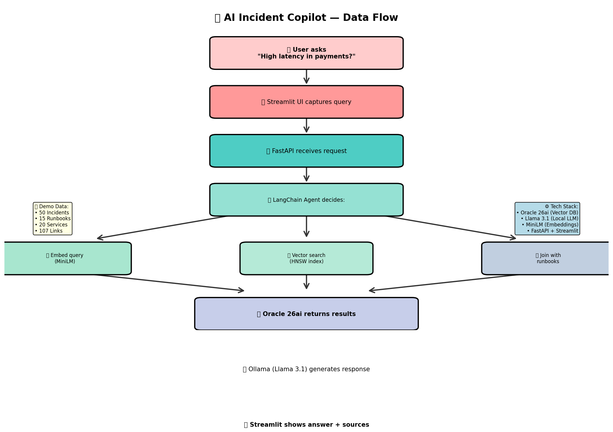
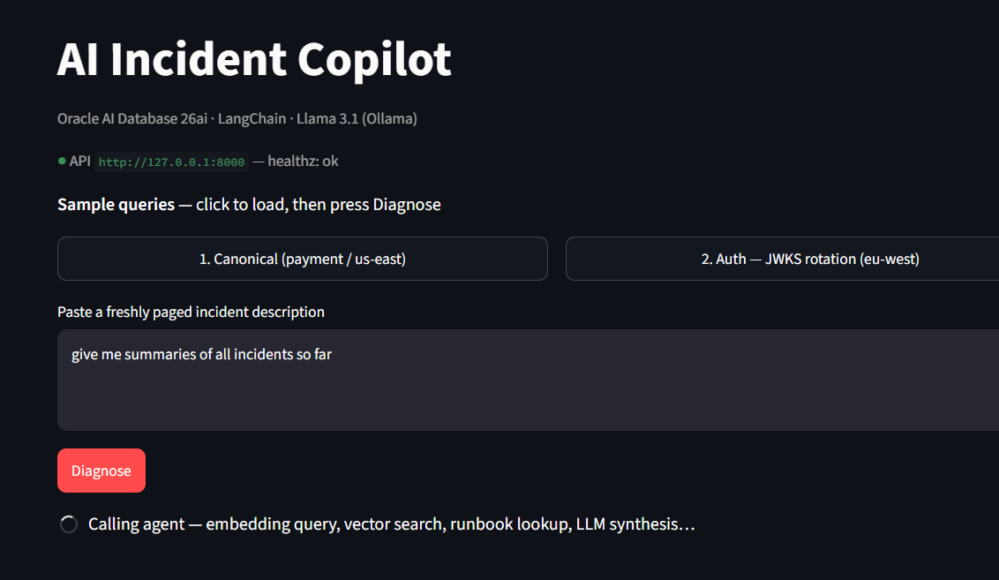

# 🚀 AI Incident Copilot — Project Overview



## What is this project?

**AI Incident Copilot** is a **Retrieval-Augmented Generation (RAG)** demo that uses **Oracle AI Database 26ai** to power an intelligent incident diagnosis assistant. It combines semantic search (vector embeddings), relational data, and a local LLM (Llama 3.1) to help DevOps teams find and resolve incidents faster.

---

## What does it do?

When you ask the system a question like:
> *"We're seeing high latency in the payment service in us-east region"*



The copilot:
1. **🔍 Searches** your incident history using semantic similarity (vector embeddings)
2. **🔗 Finds** related runbooks and solutions via relational joins
3. **🤖 Generates** a natural language response with context from past incidents
4. **📖 Shows** related runbooks and service owners

**All without leaving your infrastructure** — everything runs locally in Docker + Ollama.

---

## How does it work? (High-level)

### Architecture Flow

```
User Query (Streamlit UI)
    ↓
FastAPI Backend
    ↓
LangChain Agent (Orchestrator)
    ├─→ Embed query (MiniLM)
    ├─→ Semantic search on incidents (Oracle vectors)
    ├─→ Filter by region/category (WHERE clause)
    ├─→ Fetch related runbooks (relational join)
    ├─→ Get service owner info (relational lookup)
    └─→ Call LLM (Ollama) to synthesize response
    ↓
Response with reasoning & sources
```

### Key Components

| Layer | Technology | What it does |
|-------|-----------|-------------|
| **🎨 Frontend** | Streamlit | Web UI + sample queries |
| **🔌 API** | FastAPI | Handles incoming queries |
| **🤖 Agent** | LangChain | Decides which tools to call |
| **🦙 LLM** | Ollama (Llama 3.1) | Generates natural language |
| **📊 Embeddings** | MiniLM-L6-v2 | Converts text → 384-dim vectors |
| **🏛️ Vector DB** | Oracle 26ai | Stores incidents + vectors + metadata |
| **⚡ Index** | HNSW | Fast semantic search (COSINE distance) |

---

## The Four LangChain Tools

The agent has access to four tools (functions it can call):

1. **`find_similar_incidents`**
   - Pure semantic search on incident body text
   - Returns top-K incidents sorted by vector distance
   - Use: *"Find incidents like this problem"*

2. **`find_similar_incidents_filtered`** ⭐ (The killer demo)
   - Semantic search + WHERE filters
   - Filters by service, region, category
   - Use: *"Find latency issues in us-east"*

3. **`get_runbooks_for_incident`**
   - Relational join via incident_runbooks table
   - Retrieves solutions/runbooks for an incident
   - Use: *"What's the runbook for this issue?"*

4. **`get_service_owner`**
   - Pure relational lookup on services table
   - Returns on-call team + service tier
   - Use: *"Who owns the payment service?"*

---

## The Data

The system comes pre-populated with synthetic demo data:

- **50 Incidents** (past problems with full details)
- **15 Runbooks** (solutions organized by category)
- **20 Services** (catalog with owners and tiers)
- **107 Links** (incident → runbook mappings)

Categories: `latency`, `error_rate`, `saturation`, `availability`, `data_quality`, `auth`, `deploy_rollback`

Regions: `us-east`, `us-west`, `eu-west`, `ap-south`

---

## Quick Start

### 1️⃣ Setup (one-time)

```bash
# Create venv
python3 -m venv .venv
source .venv/bin/activate

# Install dependencies
pip install -r apps/ai-incident-copilot/requirements.txt

# Copy .env
cd apps/ai-incident-copilot && cp .env.example .env

# Start Oracle Docker container
cd /repo/root
bash apps/ai-incident-copilot/scripts/setup_db.sh

# Apply schema
docker exec -i oracle26ai bash -lc "sqlplus -S copilot/Welcome_123@FREEPDB1" \
  < apps/ai-incident-copilot/src/copilot/db/schema.sql

# Populate with demo data
PYTHONPATH=apps/ai-incident-copilot/src python3 -m copilot.db.seed

# Start Ollama
ollama pull llama3.1:8b
ollama serve &  # Run in background
```

### 2️⃣ Run (two terminals)

**Terminal 1 — Backend API:**
```bash
cd /repo/root
source .venv/bin/activate
PYTHONPATH=apps/ai-incident-copilot/src uvicorn copilot.api.main:app \
  --host 127.0.0.1 --port 8000
```

**Terminal 2 — UI:**
```bash
cd /repo/root
source .venv/bin/activate
PYTHONPATH=apps/ai-incident-copilot/src streamlit run \
  apps/ai-incident-copilot/src/copilot/ui/app.py --server.port 8501
```

### 3️⃣ Use

Open **http://localhost:8501** in your browser. Try sample queries or ask your own.

---

## Why This Matters

### The RAG Pattern

Traditional LLMs have a knowledge cutoff and can hallucinate. **RAG** solves this:

1. **Retrieve** relevant context from your own data (incidents, docs, runbooks)
2. **Augment** the prompt with that context
3. **Generate** a response grounded in your data

So the LLM never has to guess — it reads your incident history.

### Why Vector Search?

Incidents aren't always filed with the same keywords. Vector embeddings find **semantically similar** problems:

- "High latency in payments" ≈ "Payment API slow response"
- "DB connection pool exhausted" ≈ "Too many open connections"

Traditional full-text search would miss these.

### Why Oracle 26ai?

- **Native vector support** (`VECTOR` data type, HNSW indexes)
- **Hybrid queries** — combine semantic search with relational filters in one SQL statement
- **No external services** — vectors stay in your database

---

## Project Structure

```
ai-incident-copilot/
├── apps/ai-incident-copilot/
│   ├── src/copilot/
│   │   ├── agent/
│   │   │   └── tools.py          ← LangChain tool definitions
│   │   ├── api/
│   │   │   └── main.py           ← FastAPI endpoints
│   │   ├── ui/
│   │   │   └── app.py            ← Streamlit interface
│   │   ├── db/
│   │   │   ├── connection.py     ← Oracle pool
│   │   │   ├── schema.sql        ← Table + index DDL
│   │   │   └── seed.py           ← Demo data generation
│   │   └── rag/
│   │       └── embedder.py       ← MiniLM embedding wrapper
│   ├── scripts/
│   │   └── setup_db.sh           ← Docker + Oracle init
│   ├── .env.example              ← Configuration template
│   └── requirements.txt           ← Python dependencies
├── README.md                      ← Original docs
└── Install-guide-short.md         ← Step-by-step setup
```

---

## Key Concepts

### Vector Embeddings
Text is converted to a 384-dimensional vector. Similar texts have vectors that are close together in space. We use **COSINE distance** to find nearest neighbors.

### HNSW Index
A type of vector index that enables sub-millisecond nearest-neighbor search. Oracle 26ai supports it natively with `ORGANIZATION INMEMORY NEIGHBOR GRAPH`.

### Hybrid Queries
You can search by vector AND apply WHERE filters in a single query:
```sql
SELECT * FROM incidents
WHERE region = 'us-east'
ORDER BY VECTOR_DISTANCE(embedding, ?, COSINE)
FETCH FIRST 5 ROWS ONLY
```

### Idempotency
- `setup_db.sh` — can re-run safely (idempotent)
- `schema.sql` — drops and recreates tables
- `seed.py` — wipes and re-populates data

All safe to re-run without manual cleanup.

---

## Troubleshooting

### Port conflicts?
```bash
# Kill existing process on port 8000
lsof -i :8000 | grep LISTEN | awk '{print $2}' | xargs kill -9

# Or use a different port
PYTHONPATH=... uvicorn copilot.api.main:app --port 8001
```

### Oracle connection fails?
```bash
# Check container is healthy
docker ps | grep oracle26ai

# Ensure schema is applied
docker exec -i oracle26ai bash -lc "sqlplus -S copilot/Welcome_123@FREEPDB1" \
  < apps/ai-incident-copilot/src/copilot/db/schema.sql
```

### No results from vector search?
- Make sure data is seeded: `python3 -m copilot.db.seed`
- Verify vector_memory_size is set: `ALTER SYSTEM SET vector_memory_size = 512M SCOPE=SPFILE`
- Check HNSW indexes were created: `SELECT * FROM vector_indexes`

---

## Next Steps

- **Customize the data**: Modify `SERVICES`, `CATEGORIES`, `INCIDENT_TEMPLATES` in `seed.py`
- **Add more tools**: Create new LangChain `@tool` functions in `agent/tools.py`
- **Scale to production**: Use managed Oracle Cloud + authentication + monitoring
- **Integrate with your stack**: Replace demo data with real incident logs

---

## License

Universal Permissive License v 1.0 (UPL-1.0)
See LICENSE file for details.

---

## Learn More

- [LangChain Docs](https://docs.langchain.com)
- [Oracle AI Database 26ai](https://www.oracle.com/ai/generative-ai/)
- [Ollama](https://ollama.ai)
- [RAG Pattern](https://arxiv.org/abs/2005.11401)

