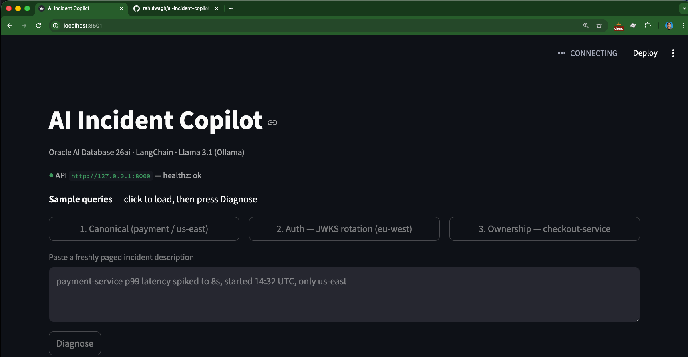
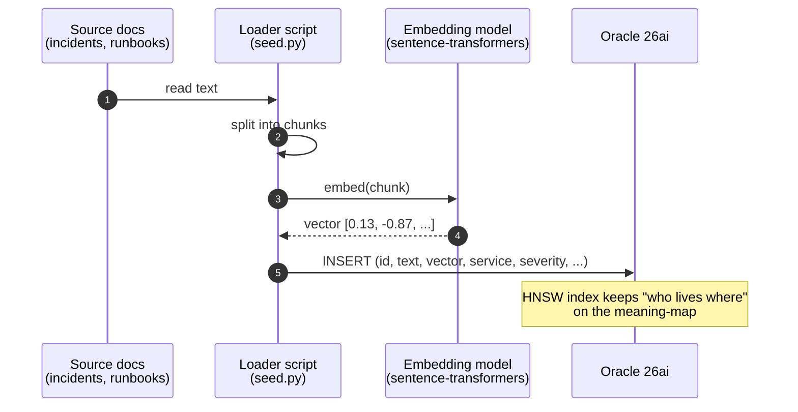
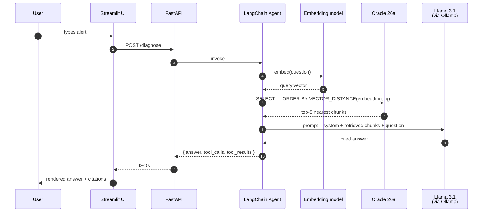

<div align="center">

# AI Incident Copilot

**Your on-call assistant — running entirely on your laptop.**

A Retrieval-Augmented Generation agent that turns a 3 AM page into a cited answer:
the right runbook, the closest past incident, and the on-call handle to wake up next.
No API keys. No internet. Zero dollars per query.

[](https://www.python.org/)
[](https://www.oracle.com/database/26ai/)
[](https://python.langchain.com/)
[](https://ollama.com/library/llama3.1)
[](https://oss.oracle.com/licenses/upl/)

</div>

<p align="center">
  
</p>

---

## Why This Exists

It's 3 AM. PagerDuty fires.

> *payment-service p99 latency spiked to 8s, started 14:32 UTC, only us-east*

You don't want to start from scratch. You want your on-call assistant to immediately ask:
*"have we seen something like this before, and is there a runbook that already covers it?"*

The catch: past incidents and runbooks almost never use the same words as your new alert.
A `LIKE '%checkout%'` query finds nothing. Keyword search hits the wall.

This project shows what happens when you replace keyword search with **vector search** —
backed by **Oracle 26ai's converged engine** so structured filters and semantic similarity
live in the *same* SQL query — and let a **LangChain agent** drive **Llama 3.1** through it
to write the answer.

All on your laptop. All offline. All free.

---

## What It Does

You type a free-text alert. The agent grounds itself in your team's history,
not the public internet, and writes back something like this:

```text
Based on past incident history (incident_id: 108), the most likely cause is
thread-pool saturation or downstream connection-pool exhaustion.

Next steps from the playbook the team used last time:
  1. Confirm the spike is regional via the per-region latency dashboard.
  2. Check thread-pool saturation and downstream connection-pool metrics —
     exhausted pools manifest as p99 spikes with flat CPU.
  3. Inspect GC pause times. Pauses >500ms indicate heap pressure;
     correlate with deploys.

Page: @payments-oncall  (service tier: critical)
```

Behind the scenes it ran a vector search, picked the closest past incident,
joined to the runbook the team actually followed, looked up service ownership —
and cited every fact it used.

---

<details>
<summary><b>Table of Contents</b></summary>

- [Architecture](#architecture)
- [The Stack](#the-stack)
- [Quick Start](#quick-start)
- [How It Works](#how-it-works)
  - [Ingestion — fill the cabinet](#ingestion--fill-the-cabinet)
  - [Query — pull pages, write answer](#query--pull-pages-write-answer)
- [Project Layout](#project-layout)
- [Sample Queries](#sample-queries)
- [Configuration](#configuration)
- [Testing](#testing)
- [Troubleshooting](#troubleshooting)
- [License](#license)

</details>

---

## Architecture

```
                        ┌──────────────────────────────────┐
   user (browser)  ───▶ │  Streamlit UI            :8501   │
                        └──────────────┬───────────────────┘
                                       │  HTTP
                                       ▼
                        ┌──────────────────────────────────┐
                        │  FastAPI  /diagnose      :8000   │
                        └──────────────┬───────────────────┘
                                       │  invoke
                                       ▼
                  ┌──────────────────────────────────────────┐
                  │  LangChain Agent  (ReAct loop)           │
                  │                                          │
                  │   reasoning ──▶  Llama 3.1 8B  via       │
                  │                  Ollama           :11434 │
                  │                                          │
                  │   tools                                  │
                  │     find_similar_incidents           ────┼───┐
                  │     find_similar_incidents_filtered  ────┼───┤
                  │     get_runbooks_for_incident        ────┼───┤
                  │     get_service_owner                ────┼───┤
                  └──────────────────────────────────────────┘   │
                                                                 ▼
                  ┌──────────────────────────────────────────────────┐
                  │  Oracle Database 26ai      (Docker)       :1521  │
                  │                                                  │
                  │  incidents.embedding   VECTOR(384, FLOAT32)+HNSW │
                  │  runbooks.embedding    VECTOR(384, FLOAT32)+HNSW │
                  │  services              relational metadata      │
                  │  incident_runbooks     join table                │
                  └──────────────────────────────────────────────────┘
```

Every component on this diagram runs on the same Mac — no internet, no cloud APIs.

---

## The Stack

| Layer        | Tool                              | Role in this project                                            |
| ------------ | --------------------------------- | --------------------------------------------------------------- |
| Database     | **Oracle Database 26ai**          | Vector search + relational filters + JSON, in one SQL query     |
| Orchestrator | **LangChain** (`langchain` 1.x)   | Agent loop, tool routing, prompt composition                    |
| Oracle ↔ LC  | **`langchain-oracledb`**          | `OracleVS` / `OracleEmbeddings` / `OracleTextSplitter`          |
| LLM          | **Llama 3.1 8B**                  | Generates the cited answer (the "brain")                        |
| LLM runtime  | **Ollama**                        | Runs Llama locally; HTTP API on `:11434`                        |
| Embeddings   | **`sentence-transformers`**       | `all-MiniLM-L6-v2`, 384 dims — turns text into vectors locally  |
| API          | **FastAPI** + **Uvicorn**         | `POST /diagnose`, `GET /healthz`                                |
| UI           | **Streamlit**                     | Browser chat surface for the demo                               |

---

## Quick Start

> Prereqs: Docker 20.10+, Python 3.10+, [Ollama](https://ollama.com/download), and ~15 GB free disk
> (Oracle image ~9 GB on disk, `llama3.1:8b` ~5 GB).

All commands run from `apps/ai-incident-copilot/`.

### 1. Boot Oracle 26ai

```bash
bash scripts/setup_db.sh
```

Pulls `container-registry.oracle.com/database/free:23.26.1.0`, starts it as `oracle26ai`
on `localhost:1521`, persists data on a named volume, and waits until the listener
actually accepts connections (not just until a log banner appears — see [Troubleshooting](#troubleshooting)).

### 2. Start Ollama and pull the model

```bash
brew services start ollama          # macOS
ollama pull llama3.1:8b
```

If you're on 8 GB RAM, swap to `llama3.2:3b`. The model name is the only change.

### 3. Configure

```bash
cp .env.example .env
```

The defaults work out of the box for a fresh setup. Override the DB password or
Ollama URL if you've changed them.

### 4. Install Python dependencies

```bash
python3 -m venv .venv
source .venv/bin/activate
pip install -r requirements.txt
```

### 5. Apply schema and seed

```bash
PYTHONPATH=src python -m copilot.db.seed
```

Idempotent — re-running drops and re-creates the demo tables.
Result: **50 incidents · 15 runbooks · 20 services · 107 incident-runbook links**, ready to query.

### 6. Run it

```bash
# Terminal 1 — FastAPI backend
PYTHONPATH=src uvicorn copilot.api.main:app --reload --port 8000

# Terminal 2 — Streamlit UI
PYTHONPATH=src streamlit run src/copilot/ui/app.py --server.port 8501
```

Open <http://localhost:8501>. Type a question. Watch the agent show its work.

<p align="center">
  
</p>

---

## How It Works

There are two distinct flows, and confusing them is the #1 RAG misconception.
**Nothing here trains a model.** Llama's weights never change. We just stuff its
prompt with the right context at query time.

### Ingestion — fill the cabinet

You run this once (or whenever you have new docs). It places stored chunks
on the meaning-map.



### Query — pull pages, write answer

This runs every time a user types something into the UI. The vector DB is
**never updated** here.



The UI surfaces every step the agent took — which tool it called, what arguments it passed,
and what came back — so nothing is hidden behind the answer:

<p align="center">
  
</p>

### Why one converged DB instead of two

A common pattern is: relational DB for filters + a separate vector DB for similarity,
then join in app code. With Oracle 26ai, both happen in one SQL query:

```sql
SELECT incident_id, service_name, summary,
       VECTOR_DISTANCE(embedding, :q, COSINE) AS dist
FROM   incidents
WHERE  service_name = 'payment-service'        -- relational filter
  AND  region = 'us-east'                      -- relational filter
  AND  occurred_at > SYSDATE - 30              -- relational filter
ORDER BY VECTOR_DISTANCE(embedding, :q, COSINE) -- vector ordering
FETCH FIRST 5 ROWS ONLY;
```

One transaction. One source of truth. No app-level joins, no two-database sync problem.

---

## Project Layout

```
apps/ai-incident-copilot/
├── README.md                       you are here
├── requirements.txt                pinned Python deps
├── docker-compose.yml              Oracle 26ai service
├── Dockerfile                      packages the FastAPI app
├── .env.example                    config template (real .env is gitignored)
│
├── scripts/
│   └── setup_db.sh                 idempotent: pull image, start container, bootstrap user
│
├── src/copilot/
│   ├── db/
│   │   ├── schema.sql              4 tables, 2 HNSW vector indexes, 3 B-tree indexes
│   │   ├── connection.py           thin oracledb client
│   │   └── seed.py                 generates 50 incidents + 15 runbooks + 20 services
│   ├── rag/
│   │   ├── embedder.py             sentence-transformers wrapper
│   │   └── vectorstore.py          OracleVS via langchain-oracledb
│   ├── agent/
│   │   ├── tools.py                4 @tool functions, parallel _impl for tests
│   │   └── copilot.py              ChatOllama + create_agent + system prompt
│   ├── api/main.py                 FastAPI: /diagnose, /healthz
│   └── ui/app.py                   Streamlit chat surface
│
└── tests/
    ├── test_smoke.py               imports + schema sanity (fast)
    └── test_retrieval.py           5 golden tests, marked `integration`
```

---

## Sample Queries

These three are pre-tested end-to-end and live in the UI as one-click buttons.

| Query                                                                          | What the agent does                                                                                                              |
| ------------------------------------------------------------------------------ | -------------------------------------------------------------------------------------------------------------------------------- |
| `payment-service p99 latency spiked to 8s, started 14:32 UTC, only us-east`    | Extracts service + region + category from natural language → `find_similar_incidents_filtered` → runbook → on-call handle.       |
| `OOMKilled pods on the user-profile deployment, traffic just doubled`          | Pure semantic recall (no service named in the prompt). Lands on memory-saturation incidents → triage runbook.                    |
| `Who owns the auth-service and who's currently on call?`                       | Single tool: `get_service_owner`. Demonstrates the relational side of the same engine.                                           |

Try variations. The agent will route to the right tool combination based on what
you actually asked for.

The third query lands on a single relational tool — the same engine, no vector search needed:

<p align="center">
  
</p>

---

## Configuration

All configuration is environment-driven. Copy `.env.example` to `.env` and edit if needed.

| Variable           | Default                                              | Notes                                                                |
| ------------------ | ---------------------------------------------------- | -------------------------------------------------------------------- |
| `ORACLE_DSN`       | `localhost:1521/FREEPDB1`                            | Easy-Connect string                                                  |
| `ORACLE_USER`      | `copilot`                                            | NOT `system` — VECTOR columns require non-SYSTEM tablespace          |
| `ORACLE_PASSWORD`  | `Welcome_123`                                        | Demo only — change for anything real                                 |
| `OLLAMA_BASE_URL`  | `http://127.0.0.1:11434`                             |                                                                      |
| `OLLAMA_MODEL`     | `llama3.1:8b`                                        | `llama3.2:3b` if RAM-constrained                                     |
| `EMBEDDING_MODEL`  | `sentence-transformers/all-MiniLM-L6-v2`             | 384 dims; matches the schema                                         |
| `EMBEDDING_DIM`    | `384`                                                | Must match the model's output dim                                    |

---

## Testing

```bash
pytest                           # unit + smoke (fast, no external services needed)
pytest -m integration            # full stack — requires DB and Ollama running
```

Markers (declared at the repo root `pyproject.toml`): `integration`, `requires_oracle`, `requires_ollama`.

The default `pytest` skips integration so CI stays cheap.

---

## Troubleshooting

<details>
<summary><b>Container starts but vector indexes fail with ORA-51962</b></summary>

The Oracle 26ai Free image ships with `vector_memory_size = 0`. Any
`CREATE VECTOR INDEX … ORGANIZATION INMEMORY NEIGHBOR GRAPH` (HNSW) needs a
non-zero pool. Fix once, persist via SPFILE, restart the container:

```bash
docker exec -i oracle26ai sqlplus -S -L sys/Welcome_123@localhost:1521/FREE as sysdba <<'SQL'
ALTER SYSTEM SET vector_memory_size = 512M SCOPE=SPFILE;
EXIT;
SQL

docker restart oracle26ai
```

512M is plenty for the demo dataset; bump to 1G if you scale to thousands of rows.

</details>

<details>
<summary><b>schema.sql fails with ORA-43853 when connected as <code>system</code></b></summary>

VECTOR columns require automatic segment space management. The SYSTEM tablespace
uses manual SSM and rejects them. Connect as the `copilot` user (default tablespace
`USERS`, ASSM-enabled) — `setup_db.sh` bootstraps this user idempotently.

</details>

<details>
<summary><b><code>setup_db.sh</code> hangs after macOS sleep/wake</b></summary>

The original "wait for log banner" pattern is fragile after Docker Desktop's VM
resumes from suspend — `docker logs` can return stale or never-completing streams.

The shipped probe runs `SELECT 1 FROM DUAL` through SQL\*Plus in silent mode and
greps for the column-header divider that always appears for a successful query.
Each call is independent and sub-second.

</details>

<details>
<summary><b>First Ollama call is slow (~28 s)</b></summary>

Ollama loads the model into memory on the first call. Subsequent calls are ~1.7 s.
Pre-warm before recording or demoing:

```bash
curl -s http://127.0.0.1:11434/api/generate \
  -d '{"model":"llama3.1:8b","prompt":"warm","stream":false}' >/dev/null
```

</details>

<details>
<summary><b>Llama 3.1 misinterprets "RAG"</b></summary>

The bare acronym is ambiguous — Llama will sometimes answer with the immunology
gene (*Recombinase-Activating Gene*) instead of *Retrieval-Augmented Generation*.
The agent's system prompt always uses the full term in context, but if you talk
to the model directly, spell it out.

</details>

---

## License

Copyright (c) 2026 Oracle and/or its affiliates.

Licensed under the Universal Permissive License v 1.0
as shown at <https://oss.oracle.com/licenses/upl/>.
